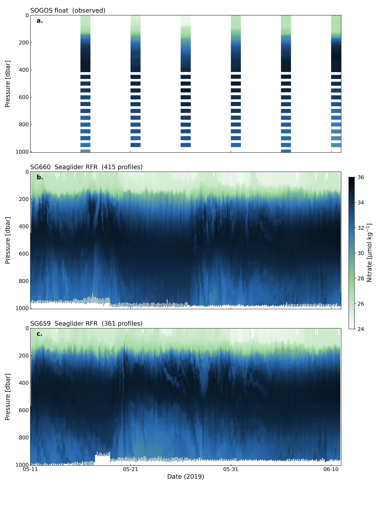

# Argo-Seaglider RFR Reproduction

Reproduction of the random forest regression pipeline from:

> Song, S., et al. *Random forest regression using autonomous in situ ocean observations: Inferring small-scale nutrient variability during a Southern Ocean field experiment.* doi: https://doi.org/10.1175/AIES-D-24-0048.1

The model learns a mapping from hydrographic variables (Θ, Sₐ, p, O₂, space, time) to nitrate, trained on BGC-Argo floats and GO-SHIP bottle data, then applied to high-resolution Seaglider observations to infer nitrate at ~1.5 km / 2–3 h resolution — roughly 50× finer than the co-deployed float.

## Data

All training and test data are from the author's Zenodo release:

| Dataset | DOI |
|---------|-----|
| Full RFR data archive (training + test + glider predictions) | [10.5281/zenodo.17508960](https://doi.org/10.5281/zenodo.17508960) |
| SOGOS RFR nitrate estimates on gliders | [10.5281/zenodo.14510704](https://doi.org/10.5281/zenodo.14510704) |
| Processed Seaglider datasets (Balwada 2023) | [10.5281/zenodo.8361656](https://doi.org/10.5281/zenodo.8361656) |

Original sources cited in the paper:
- Argo GDAC: [10.17882/42182](https://doi.org/10.17882/42182)
- GO-SHIP I06: [cchdo.ucsd.edu/cruise/325020190403](https://cchdo.ucsd.edu/cruise/325020190403)
- GO-SHIP I07: [cchdo.ucsd.edu/cruise/49NZ20191229](https://cchdo.ucsd.edu/cruise/49NZ20191229)
- CMEMS altimetry: [10.48670/moi-00148](https://doi.org/10.48670/moi-00148)

## Model

Random forest regressor (scikit-learn) with the paper's exact hyperparameters:

- 1000 trees, `max_features=1/3`, `min_samples_leaf=5`
- 9 features: CT, SA, pressure, oxygen, lat, lon, yearday, ydcos, ydsin
- Profile-aware splitting (holdout 20%, k-fold k=10, spatial leave-one-out per float)

### Independent test results

Results from final 1000-tree model (seed=42), evaluated on data never seen during training.

| Metric | Paper | This repo |
|--------|-------|-----------|
| SOGOS float MAE | 0.208 | 0.201 |
| SOGOS float IQR-AE | 0.281 | 0.285 |
| SOGOS float mean bias | −0.008 | +0.010 |
| SOGOS % within ±0.5 µmol kg⁻¹ | 87% | 85.9% |
| SOGOS 95% error bounds | [−0.70, +0.69] | [−0.83, +0.67] |
| GO-SHIP I07 MAE | 0.257 | 0.251 |
| GO-SHIP I07 % within ±0.5 µmol kg⁻¹ | 75% | 76.0% |

### Triple validation (within training set)

| Scheme | Combined MAE | Description |
|--------|:-----------:|-------------|
| Holdout 20% | 0.341 | Random split, profiles kept intact |
| k-Fold (k=10) | 0.393 | GroupKFold, profiles not split across folds |
| Spatial LOO | 0.393 | Withhold one float (WMO) at a time |

Per-float spatial LOO MAE ranges from 0.25 to 0.70 µmol kg⁻¹, consistent with the paper's finding that float-to-float generalizability varies by region.

### Glider application

| Glider | Observations | Inferred nitrate range |
|--------|:-----------:|------------------------|
| SG659 | 862,039 | 24.35 – 35.81 µmol kg⁻¹ |
| SG660 | 947,968 | 24.08 – 35.89 µmol kg⁻¹ |

OOB R² of the final model: 0.9965.

## Reproduced figures

### Figure 7 — Nitrate depth-time sections (11 May – 10 Jun 2019)

Generated by `time_series_viz.py`. Three stacked panels matching the paper's Fig. 7:

- **(a)** SOGOS float 5906030 observed nitrate — 6 profiles over ~30 days
- **(b)** SG660 Seaglider RFR-inferred nitrate — same period, ~428 profiles
- **(c)** SG659 Seaglider RFR-inferred nitrate — extension beyond the paper



The Seaglider panels demonstrate the ~50× resolution gain over the co-deployed float: ~1.5 km horizontal / 2–3 h temporal vs. ~75 km / 5 d for the Argo float.

## Quick start

```bash
# Install dependencies
uv sync

# 1. Download data (~400 MB, one-time)
uv run python data/fetch_zenodo.py --main

# 2. Preprocess (TEOS-10, seasonal encoding, train/test split)
uv run python preprocess/pipeline.py --training --test

# 3. Full pipeline: train, validate, test, apply to gliders
uv run python model.py --all

# Run tests
uv run pytest test/ -v
```

## Project structure

```
├── model.py                 # RFR training, triple validation, evaluation
├── preprocess/
│   └── pipeline.py          # TEOS-10, MLD, seasonal encoding, feature selection
├── utils/
│   ├── teos10.py            # gsw-based thermodynamic calculations
│   ├── features.py          # seasonal encoding, 9-feature selection
│   └── mld.py               # mixed layer depth, N_ML, ΔN_ML
├── test/                    # pytest (81 tests)
├── data/
│   ├── fetch_zenodo.py      # download from Zenodo
│   ├── fetch_argo.py        # download from Argo GDAC
│   ├── fetch_goship.py      # download from CCHDO
│   └── fetch_seaglider.py   # download from NOAA NCEI
└── pyproject.toml
```

## Requirements

Python ≥3.13. Dependencies managed by [uv](https://docs.astral.sh/uv/): scikit-learn, pandas, numpy, gsw, xarray, argopy.

## Notes

- The trained `.pkl` model (~315 MB) and all downloaded/processed data are excluded from git. Run steps 1–3 above to regenerate.
- All random seeds are fixed at 42 for reproducible results.
- CANYON-B and ESPER-Mixed benchmarks require separate installation (see `model.py --benchmark`).
